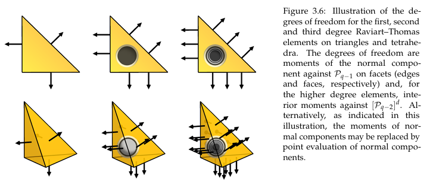

# 混合Laplace方程的求解

看了那么久的Laplace方程，总得往前一步，这一步求解的就是混合Laplace方程。虽然名称里面带有Laplace，但求解方式和其天差地别，以此作为数值实验的一部分，更进一步理解不同类型的基函数的作用。

>主要的内容参考
>
>* Trilinos Panzer实例代码
>* Deal.II的教程代码
>* Fencis官方参考理论
>* 有限元方法-石钟慈，王鸣著
>* 有限元方法及其应用-李开泰著
>* 间断有限元理论与方法-张铁著
>* Convex Optimization

## 混合Laplace方程

$$
\begin{aligned}
    \mathbf{u}+\nabla p &= 0\qquad in\ \Omega\\
    \nabla \cdot \mathbf{u} & = f\quad in\ \Omega \\
    p &= g \quad on \ \partial \Omega
\end{aligned}
$$

这个形式其实就是引入了一个中间向量$\mathbf{u}$，将散度和梯度项进行拆分。这个方程可能不是很眼熟，但如果让第二个等式中的$f$为0，第一个等式中的$\mathbf{u}$变成$(\nabla\cdot\mathbf{u}) \mathbf{u}$，再添加一个重力场，上述方程就变成了稳态的欧拉方程，关于散度项的离散会在后续进一步使用DG进行逐一验证。

## 方程求解的难点

这个方程乍一看似乎没有什么困难的地方(大嘘)，可以说是非常离谱。

* 难点一，散度项如何离散，如何确保散度项的离散不会出现数值问题
* 难点二，分块矩阵怎么处理，是直接求解还是分块计算
* 难点三，能不能和之前一样使用$HGrad$基函数，用了会有什么影响

## 离散过程-Raviart-Thomas单元

Raviart-Thomas单元单元的构造和拉格朗日单元完全不同，这个单元在边界的形状中心是连续的。具体图片可以参看Fenics官方PDF提供的图片。

和之前所有的方程一样，首先第一步是两侧乘以检验函数$v$，并使用分部积分进行展开，展开的目的主要是为了降低导数的阶数，在展开时使用高斯散度定理将散度算符转换为边界积分，除开本性边界外，黎曼边界就是在此时引入弱形式。

对于这个例子来说，和之前不同的地方在于，这组方程中包括两个未知量$\mathbf{u},p$，后续为了表述方便，$\mathbf{u}$记为速度，$p$记为压力。故此我们选择的有限元检验函数和测试空间就需要分别对于这两个不同的未知量进行区别。

此处取$\mathbf{v}\in H(div)，p\in L^2$，将两组方程同时乘以检验函数并积分，可以得到如下：
$$
\begin{aligned}
    \int_{\Omega}\mathbf{u}\cdot \mathbf{v}+\int_{\Omega}\nabla p\cdot \mathbf{v} &=0\\
    \int_{\Omega}(\nabla \cdot \mathbf{u}) q - \int_{\Omega}f q&=0
\end{aligned}
$$
对第一个方程中的$\int_{\Omega}\nabla p\cdot \mathbf{v}$进行分部积分展开，可以得到：
$$
\begin{aligned}
    \int_{\Omega}\nabla p\cdot \mathbf{v} = \int_{\partial\Omega}p \mathbf{v}\cdot \mathbf{n} -
    \int_{\Omega}(\nabla \cdot \mathbf{v}) p
\end{aligned}
$$
带入边界条件$p=g\quad on\ \partial \Omega$，修改检验函数空间，使得在部分/全部边界上检验函数不为0。

>这里非常有必要解释一下为什么不对第二个等式中的散度项进行分部积分展开，这个问题在我刚刚开始接触这类问题的时候也比较迷惑。主要由LBB条件决定。
>* Ladyzhenskaya–Babuška–Brezzi条件(LBB条件)
$$
\exists \beta > 0,\quad\forall q_h\in L^2(\Omega),\quad
\sup_{v_h \in H_0^1}\frac{|(\nabla \cdot v, q_h)_{L^2}|}{||v_h||_{H_0^1}||q_h||_{L^2}}
\geq \beta
$$
上述方程等价于$inf-sup$表述：
$$
\exists \beta > 0,\quad
\inf_{q_h \in L^2(\Omega)}
\sup_{v_h \in H_0^1}\frac{|(\nabla \cdot v,q_h)_{L^2}|}{||v_h||_{H_0^1}||q_h||_{L^2}}
\geq \beta
$$

>具体的证明不会详细介绍，具体来说就是要求算子$grad\ p$的像在对偶空间$V'$中是闭的。得到范数的对应关系，展开范数就能得到上述方程。这个最大最小问题于有限元选择的联系在于，如果满足这个条件$grad\ p_h-\Pi_{V_h} grad\ p_h$可以被重新引入，如果使用$P_1$连续有限元，投影算子$\Pi_{V_h}:L^2(\Omega)\rightarrow V_h$在单元上是常数，会直接丢失信息。其实就是选择和对应有限元匹配的投影算子。剩下的一时半会不能完全搞懂。

>根据LBB条件，典型的可选择的有限元对：
>* $P_2,P_1$ Taylor–Hood元
>* $P_1-bubble,P_1$ Arnold–Brezzi–Fortin元
>* $P_2,P_0$ Crouzeix–Raviart元  

上述离散形式可以被整理如下：
$$
\begin{aligned}
    \int_{\Omega}\mathbf{v}\cdot \mathbf{u}-
    \int_{\Omega}(\nabla \cdot \mathbf{v}) p  &=
    -\int_{\partial\Omega} \mathbf{v}\cdot \mathbf{n}p\\
    \int_{\Omega}q(\nabla \cdot \mathbf{u})&= \int_{\Omega}qf
\end{aligned}
$$

下一步就是根据弱形式进行计算，整个计算过程不算多复杂，分配完基函数后，按照弱形式对单元刚度矩阵和右端项进行积分求和。比较抽象的地方在于得到的总体刚度矩阵是一个分块矩阵，具体如下：

$$
\begin{aligned}
    \begin{pmatrix}
        M&B\\
        B^T&0
    \end{pmatrix}
    \begin{pmatrix}
        U\\
        P
    \end{pmatrix}=
    \begin{pmatrix}
        V\\
        F
    \end{pmatrix}
\end{aligned}
$$

其中$M$矩阵表示质量矩阵，$B$表示散度矩阵，$V$表示边界值，$F$表示源项。

>这个分块矩阵的形式非常的简单，我当时的第一反应就是直接将第二行进行求逆解出来压力$P$再回代到第一行计算出来速度$U$。这样也就算出来了。如果你和我当时一样的话，恭喜你，标准的0分,再思考一下矩阵$B$,其列对应于$P$的大小,行对应于$U$的大小,实际上不是一个方阵:)

按照标准的分块矩阵消元可以将上述方程的形式变换为:

$$
\begin{aligned}
    \begin{pmatrix}
        M&B\\
        0&B^TM^{-1}B
    \end{pmatrix}
    \begin{pmatrix}
        U\\
        P
    \end{pmatrix}=
    \begin{pmatrix}
        V\\
        B^TMV-F
    \end{pmatrix}
\end{aligned}
$$

其实就是Schur补,这样对于矩阵$B^TM^{-1}B$就是一个方阵,这样先计算第二行求解得到矩阵$P$,
再回代到第一行中计算得到$U$,这样就没有问题.

>对对对,对吗? 虽然说矩阵$M$是质量矩阵,形式比较简单,但是这个矩阵的逆矩阵一般来说都不是稀疏矩阵.无法在计算机的内存中储存

这里使用的方法也比较简单,先组装好每个部分的矩阵,将$M^{-1}$矩阵表示为线性求解问题,不显示的存储其逆矩阵,而是将其视为一个线性问题,具体来说执行如下步骤.

* $y=Bx$
* $Mz=y\quad GMRES \ Solver$
* $x^*=B^Tz$

这样提供一个比较抽象的矩阵向量计算后,就可以使用标准的线性迭代求解器进行计算.

